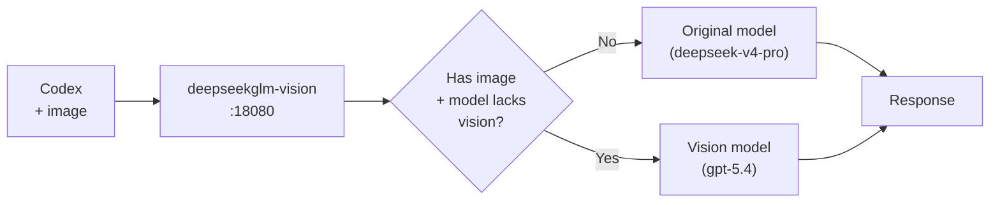

# deepseekglm-vision

[English](README.md) | [简体中文](README.zh.md)

OpenAI-compatible multimodal routing middleware for model alias switching.

This project is intentionally small: it sits between your client and an OpenAI-compatible backend, inspects only the current request, and forwards everything else as-is. It is designed for deployments where a text backend and a vision-capable backend share the same API shape.

## What It Does

By default, requests are forwarded to:

```env
DEFAULT_BACKEND_BASE_URL=http://127.0.0.1:8090/v1
```

The following model names are treated as multimodal aliases, case-insensitively:

- `GLM-5.1`
- `GLM-5`
- `deepseek-v4-pro`
- `deepseek-v4-flash`

When the latest user message contains an image input and the requested model matches one of those aliases, the middleware rewrites the upstream `model` to:

```text
gpt-5.4
```

Text-only requests are not rewritten, even if the model name is one of the aliases. They are passed through to the default backend unchanged.

## Vision Fallback Mode

In addition to explicit multimodal aliases, the middleware can also handle text-model fallback for image requests.

Use this when a client sends an image while still using a text/non-vision model such as `deepseek-v4-pro`. The middleware can keep normal text requests on the original model, but rewrite image requests to a configured vision model.

```env
VISION_FALLBACK_ENABLED=true
VISION_FALLBACK_MODELS=deepseek-v4-pro
VISION_FALLBACK_MODEL=gpt-5.4
```

Behavior:

- `deepseek-v4-pro` + no image: keep original model, pass through
- `deepseek-v4-pro` + latest user message has image: rewrite upstream `model` to `gpt-5.4`
- API key and other request parameters are still handled by the selected route mode



## API Key Handling

The middleware supports three API key strategies, matching the three route modes.

### 1. Pass-through key mode

This is the default behavior in `ROUTE_MODE=default`.

```env
ROUTE_MODE=default
DEFAULT_BACKEND_BASE_URL=http://127.0.0.1:8090/v1
```

The middleware does not own or replace the API key. Whatever key the client sends in `Authorization: Bearer ...` or `x-api-key: ...` is forwarded to the upstream backend at `127.0.0.1:8090`.

This applies to both text-only requests and image requests in default mode. If an image request needs model rewriting, only the top-level `model` is changed; the API key is still passed through unchanged.

### 2. Custom vision backend key

Use this when only multimodal image requests should call a separate vision backend with its own key.

```env
ROUTE_MODE=custom-vision
VISION_BACKEND_BASE_URL=https://vision-api.example.com/v1
VISION_BACKEND_API_KEY=sk-vision
```

Behavior:

- Text-only requests continue to use the incoming client key and go to `DEFAULT_BACKEND_BASE_URL`.
- Image requests that match a multimodal alias go to `VISION_BACKEND_BASE_URL`.
- If `VISION_BACKEND_API_KEY` is set, that key is used for the vision backend.
- If `VISION_BACKEND_API_KEY` is empty, the incoming client key is reused.

### 3. Custom all-backend key

Use this when all specified-model requests should call a custom backend with its own key.

```env
ROUTE_MODE=custom-all
CUSTOM_BACKEND_BASE_URL=https://api.example.com/v1
CUSTOM_BACKEND_API_KEY=sk-custom
```

Behavior:

- Any request with a `model` goes to `CUSTOM_BACKEND_BASE_URL`.
- If `CUSTOM_BACKEND_API_KEY` is set, it replaces the incoming client key.
- If `CUSTOM_BACKEND_API_KEY` is empty, the incoming client key is reused.

## Important Routing Detail

For multi-turn conversations, the middleware only checks the latest `role=user` message:

- `/v1/chat/completions`: checks the last user item in `messages`
- `/v1/responses`: checks the last user item in `input`

This prevents an old image in conversation history from forcing later text-only follow-up messages onto the vision model.

## Supported Protocols

The middleware supports both OpenAI-compatible and Claude/Anthropic-compatible request shapes.

Supported JSON endpoints include:

- OpenAI Chat Completions: `/v1/chat/completions`
- OpenAI Responses API: `/v1/responses`
- Claude Messages API: `/v1/messages`
- Other OpenAI-compatible `/v1/*` paths are passed through to the default backend

Authentication header handling:

- OpenAI style: `Authorization: Bearer <key>`
- Claude style: `x-api-key: <key>`

In pass-through mode, the middleware preserves the incoming auth style. A Claude request with `x-api-key` is forwarded upstream with `x-api-key`, not converted into `Authorization`.

## Supported Image Formats

The middleware recognizes common OpenAI-compatible and Claude-compatible image payloads and preserves them unchanged.

Chat Completions style:

```json
{
  "model": "GLM-5.1",
  "messages": [
    {
      "role": "user",
      "content": [
        { "type": "text", "text": "Describe this image" },
        {
          "type": "image_url",
          "image_url": {
            "url": "https://example.com/image.png",
            "detail": "high"
          }
        }
      ]
    }
  ]
}
```

Responses API style:

```json
{
  "model": "glm-5.1",
  "input": [
    {
      "role": "user",
      "type": "message",
      "content": [
        { "type": "input_text", "text": "Describe this image" },
        { "type": "input_image", "image_url": "data:image/png;base64,..." }
      ]
    }
  ]
}
```

Claude Messages API style:

```json
{
  "model": "deepseek-v4-flash",
  "max_tokens": 512,
  "messages": [
    {
      "role": "user",
      "content": [
        { "type": "text", "text": "Describe this image" },
        {
          "type": "image",
          "source": {
            "type": "base64",
            "media_type": "image/png",
            "data": "..."
          }
        }
      ]
    }
  ]
}
```

Claude URL image source is also recognized:

```json
{
  "type": "image",
  "source": {
    "type": "url",
    "url": "https://example.com/image.png"
  }
}
```

## Route Modes

### `default`

```env
ROUTE_MODE=default
DEFAULT_BACKEND_BASE_URL=http://127.0.0.1:8090/v1
VISION_BACKEND_MODEL=gpt-5.4
```

Behavior:

- Text-only requests: pass through to `DEFAULT_BACKEND_BASE_URL`
- Latest user message contains image + alias model: pass to `DEFAULT_BACKEND_BASE_URL`, rewrite `model` to `VISION_BACKEND_MODEL`
- Incoming API key is reused for upstream calls

### `custom-vision`

```env
ROUTE_MODE=custom-vision
DEFAULT_BACKEND_BASE_URL=http://127.0.0.1:8090/v1
VISION_BACKEND_BASE_URL=https://vision-api.example.com/v1
VISION_BACKEND_API_KEY=sk-vision
VISION_BACKEND_MODEL=gpt-5.4
```

Behavior:

- Text-only requests: pass through to `DEFAULT_BACKEND_BASE_URL`
- Latest user message contains image + alias model: route to `VISION_BACKEND_BASE_URL`
- `VISION_BACKEND_API_KEY` is used if set; otherwise the incoming API key is reused

### `custom-all`

```env
ROUTE_MODE=custom-all
DEFAULT_BACKEND_BASE_URL=http://127.0.0.1:8090/v1
CUSTOM_BACKEND_BASE_URL=https://api.example.com/v1
CUSTOM_BACKEND_API_KEY=sk-custom
CUSTOM_BACKEND_MODEL=
```

Behavior:

- Any request with a `model` is routed to `CUSTOM_BACKEND_BASE_URL`
- `CUSTOM_BACKEND_API_KEY` is used if set; otherwise the incoming API key is reused
- If `CUSTOM_BACKEND_MODEL` is set, the upstream `model` is rewritten to that value

## Install

Requires Node.js 18.17 or newer.

```bash
cp .env.example .env
npm test
npm start
```

Health check:

```bash
curl http://127.0.0.1:8080/health
```

## Example Request

```bash
curl http://127.0.0.1:8080/v1/chat/completions \
  -H "Authorization: Bearer sk-test" \
  -H "Content-Type: application/json" \
  -d '{"model":"GLM-5.1","messages":[{"role":"user","content":[{"type":"text","text":"describe"},{"type":"image_url","image_url":{"url":"https://example.com/image.png"}}]}]}'
```

The upstream request will keep all payload fields unchanged except the top-level `model`, which becomes `gpt-5.4`.

## systemd Deployment

Example install path:

```bash
/www/wwwroot/deepseekglm-vision
```

Service file:

```ini
[Unit]
Description=deepseekglm-vision middleware
After=network.target

[Service]
Type=simple
WorkingDirectory=/www/wwwroot/deepseekglm-vision
Environment=NODE_ENV=production
ExecStart=/usr/bin/node src/server.js
Restart=always
RestartSec=3

[Install]
WantedBy=multi-user.target
```

Commands:

```bash
systemctl daemon-reload
systemctl enable --now deepseekglm-vision
systemctl status deepseekglm-vision
```

## NGINX Reverse Proxy Split

If your existing site already proxies to `127.0.0.1:8090`, you can split only OpenAI API traffic to this middleware while keeping all other paths unchanged.

Example:

```nginx
location ^~ /v1/
{
    proxy_pass http://127.0.0.1:18080;
    proxy_set_header Host $host;
    proxy_set_header X-Real-IP $remote_addr;
    proxy_set_header X-Forwarded-For $proxy_add_x_forwarded_for;
    proxy_set_header X-Forwarded-Proto $scheme;
    proxy_set_header Upgrade $http_upgrade;
    proxy_set_header Connection $connection_upgrade;
    proxy_http_version 1.1;
    proxy_buffering off;
    proxy_cache off;
    proxy_read_timeout 600s;
    proxy_send_timeout 600s;
}

location ^~ /
{
    proxy_pass http://127.0.0.1:8090;
}
```

## Tests

```bash
npm test
```

The test suite covers:

- Case-insensitive model alias matching
- Text-only alias requests staying on the text backend
- Image requests being rewritten to `gpt-5.4`
- OpenAI `image_url` and `input_image` compatibility
- Multi-turn history where old image turns must not affect the latest text-only turn

## License

MIT
